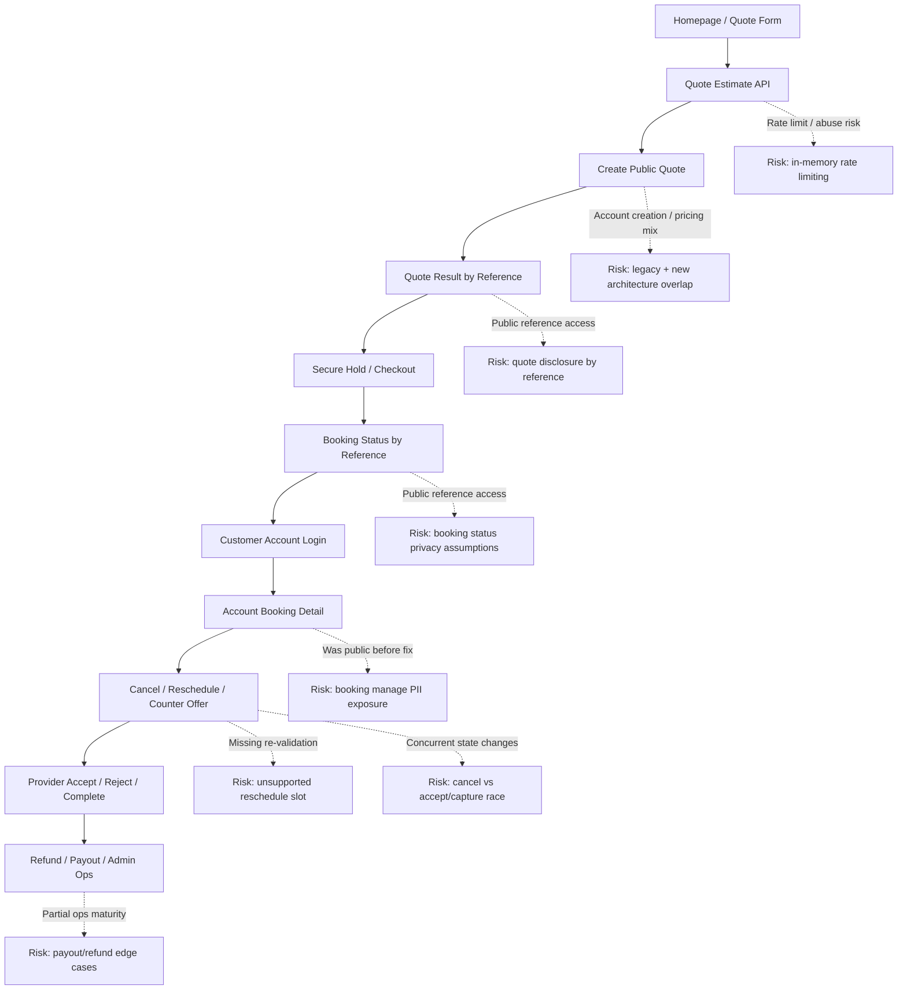

# Customer Flow Risk Map (2026-04-07)

## Sensitive Data Boundaries

- **Public pages** should avoid exposing customer PII and provider identity unless absolutely necessary
- **Reference-based pages** must assume links can be forwarded or guessed and should expose the minimum viable information only
- **Authenticated account pages** are the only safe place for full booking details, address details, contact details, receipts, cancellation, and reschedule controls
- **Provider identity** should only be shown when the product/business rule explicitly allows it

## Highest-Risk Customer Nodes

1. `Quote Result by Reference`
2. `Booking Status by Reference`
3. `Booking Manage` (now gated to signed-in customer session)
4. `Cancel / Reschedule / Counter Offer`
5. `Refund / Payout / Admin Ops`

## Recommended Safeguards

- Keep public-by-reference pages minimal
- Gate all full booking details behind authenticated customer session
- Re-validate provider availability/pricing before any customer-initiated reschedule is committed
- Add stronger production-grade rate limiting and request auditing
- Add end-to-end tests for quote -> checkout -> booking -> cancel/reschedule -> refund flows
